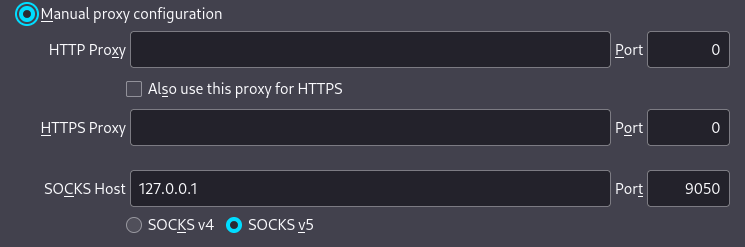
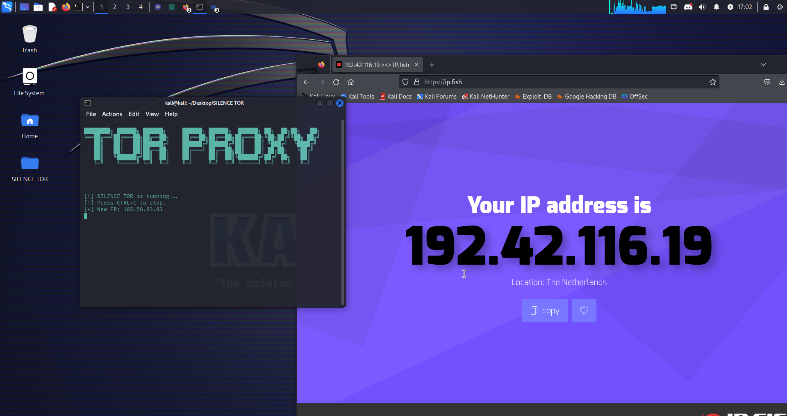

# Documentation for SILENCE TOR passing through Tor proxy with advanced network details for Tor

# This code snippet demonstrates how to configure SILENCE TOR to pass through a Tor proxy and provides advanced network details for Tor.

# Steps to configure SILENCE TOR to pass through Tor proxy:
# 1. Install the Tor proxy software on your system.
# 2. Import the necessary libraries for SILENCE TOR and network configuration.
# 3. Set the proxy settings for Firefox to use the Tor proxy.
# 4. Test the connection to ensure SILENCE TOR is successfully passing through the Tor proxy.

# Example code:

```bash
pip3 install requests
pip3 install colorama
```

# Set the FireFox Tor proxy settings


# Configure advanced network details for Tor


# Test the connection


# Note: Make sure to have the Tor proxy software installed and running on your system before executing this code.
